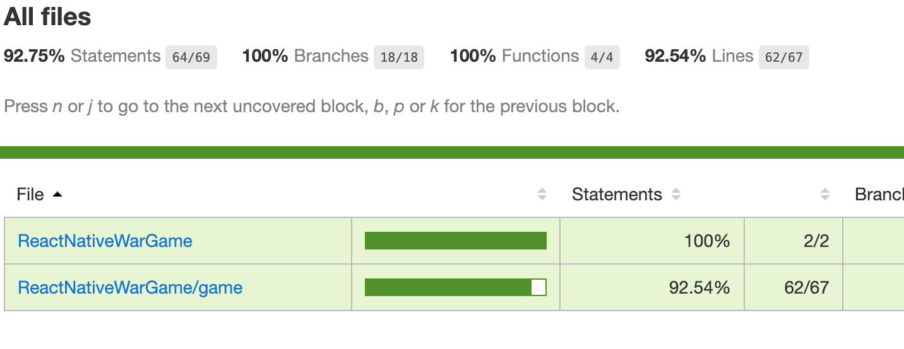

## Answers...

Hope you did some of the exercises from Part 1.

1. What happens when there are multiple ties? Does the code work? Write a test for player 1 and then get that to work, then write the test for player 2.
   this is our test:

```
it('play game: multiple ties, player 1 wins hand', () => {
  const game = new Game();
  game.player1.cards = [
    new Card(Rank.King, Suit.Spade), //initial tie
    new Card(Rank.Three, Suit.Spade),
    new Card(Rank.Five, Suit.Spade),
    new Card(Rank.Four, Suit.Spade),
    new Card(Rank.Queen, Suit.Spade), // 2nd tie
    new Card(Rank.Seven, Suit.Spade),
    new Card(Rank.Eight, Suit.Spade),
    new Card(Rank.Nine, Suit.Spade),
    new Card(Rank.Jack, Suit.Spade), //winner
    new Card(Rank.Ten, Suit.Spade),
  ];
  game.player2.cards = [
    new Card(Rank.King, Suit.Club), //initial tie
    new Card(Rank.Three, Suit.Club),
    new Card(Rank.Five, Suit.Club),
    new Card(Rank.Four, Suit.Club),
    new Card(Rank.Queen, Suit.Club), // 2nd tie
    new Card(Rank.Seven, Suit.Club),
    new Card(Rank.Eight, Suit.Club),
    new Card(Rank.Nine, Suit.Club),
    new Card(Rank.Two, Suit.Club), //loser
    new Card(Rank.Ten, Suit.Club),
  ];
  const handResult = game.play();
  expect(handResult.result).toBe(GameResult.PlayerTie);
  expect(handResult.player1Cards[0].toShortString()).toBe('ks');
  expect(handResult.player2Cards[0].toShortString()).toBe('kc');
  expect(game.player1.cards).toHaveLength(9);
  expect(game.player2.cards).toHaveLength(9);
  const handResult2 = game.play();
  expect(handResult2.result).toBe(GameResult.Player2Tie);
  expect(handResult2.player1Cards).toHaveLength(4);
  expect(handResult2.player2Cards).toHaveLength(4);
  expect(handResult2.player1Cards[3].toShortString()).toBe('qs');
  expect(handResult2.player2Cards[3].toShortString()).toBe('qc');
  expect(game.player1.cards).toHaveLength(5);
  expect(game.player2.cards).toHaveLength(5);
  const handResult3 = game.play();
  expect(handResult3.result).toBe(GameResult.Player1Wins);
  expect(handResult3.player1Cards).toHaveLength(4);
  expect(handResult3.player2Cards).toHaveLength(4);
  expect(handResult3.player1Cards[3].toShortString()).toBe('js');
  expect(handResult3.player2Cards[3].toShortString()).toBe('2c');
  expect(game.player1.cards).toHaveLength(19);
  expect(game.player2.cards).toHaveLength(1);
});
```

But we see an error:

```
play game: multiple ties, player 1 wins hand

    expect(received).toHaveLength(expected)

    Expected length: 19
    Received length: 13
    ...
```

So should we be expecting 19? That is correct. Looks like a bug, so lets fix that in the code.
You can try to figure out this in the following 3 ways (or it could be a combination of the ways)

1. Logically following the code.
2. Putting `console.log` in opportune places.
3. Or starting the debugger and stepping through the code.

I ended up putting some `console.log` statements printing the length of the arrays. I'll go over
debugging a little later.
It seems we are not adding the currently hidden cards to the player tied cards. Lets modify the 2
lines in the tie case (right after we set the `gameTied` variable to true).

```
   this.gameTied = true;
   this.player1TiedCards.push(card1, ...player1HiddenCards);
   this.player2TiedCards.push(card2, ...player2HiddenCards);
```

That should do the trick.
Now write the same test for player 2 winning.

2. How about when there is a tie and one player doesn't have enough cards? Write that test.

```
it('play game: tie, player 1 runs out of cards, player 2 wins', () => {
  const game = new Game();
  game.player1.cards = [
    new Card(Rank.King, Suit.Spade), //initial tie
    new Card(Rank.Three, Suit.Spade),
    new Card(Rank.Five, Suit.Spade),
  ];
  game.player2.cards = [
    new Card(Rank.King, Suit.Club), //initial tie
    new Card(Rank.Three, Suit.Club),
    new Card(Rank.Five, Suit.Club),
    new Card(Rank.Four, Suit.Club),
    new Card(Rank.Queen, Suit.Club),
  ];
  const handResult = game.play();
  expect(handResult.result).toBe(GameResult.PlayerTie);
  expect(handResult.player1Cards[0].toShortString()).toBe('ks');
  expect(handResult.player2Cards[0].toShortString()).toBe('kc');
  expect(game.player1.cards).toHaveLength(2);
  expect(game.player2.cards).toHaveLength(4);
  const handResult2 = game.play();
  expect(handResult2.result).toBe(GameResult.Player2Wins);
  expect(handResult2.player1Cards).toHaveLength(2);
  expect(handResult2.player2Cards).toHaveLength(4);
  expect(game.player1.cards).toHaveLength(0);
  expect(game.player2.cards).toHaveLength(8);
});
```

To get this test to pass we will need to add some code the `if(game.isTied)` case. We need to check if player 1 has less then 4 cards and if so then we need give player 2 all of player 1's cards and return the game winning result.

```
  if (this.player1.cards.length < 4) {
    const player1Cards = this.player1.cards.slice(0);
    this.player2.cards.push(
      ...this.player1TiedCards,
      ...this.player2TiedCards,
      ...player1Cards
    );
    this.player1.cards = [];
    return {
      result: GameResult.Player2Wins,
      player1Cards: player1Cards,
      player2Cards: this.player2.cards.slice(0, 4),
    };
  }
```

Also go ahead and add a test and code for the opposite case.

3. Write tests for game winning situations.
   First lets identify what conditions exist for a player to win a game. One of the players needs to run out of cards. Simple as that.
   So lets start with test:

```
it('play game: player 1 wins game', () => {
  const game = new Game();
  game.player1.cards = [
    new Card(Rank.Ace, Suit.Club),
    new Card(Rank.Three, Suit.Club),
    new Card(Rank.Five, Suit.Club),
    new Card(Rank.Four, Suit.Club),
    new Card(Rank.Queen, Suit.Club),
  ];
  game.player2.cards = [new Card(Rank.King, Suit.Spade)];
  const handResult = game.play();
  expect(handResult.result).toBe(GameResult.Player1Wins);
  expect(handResult.player1Cards[0].toShortString()).toBe('ac');
  expect(handResult.player2Cards[0].toShortString()).toBe('ks');
  expect(game.player1.cards).toHaveLength(6);
  expect(game.player2.cards).toHaveLength(0);
  const handResult2 = game.play();
  expect(handResult2.result).toBe(GameResult.Player1WinsGame);
  expect(handResult2.player1Cards).toHaveLength(0);
  expect(handResult2.player2Cards).toHaveLength(0);
  expect(game.player1.cards).toHaveLength(6);
  expect(game.player2.cards).toHaveLength(0);
});
```

Our best way most likely is to test if a players is out of cards in the beginning of the function:

```
    if (this.player2.cards.length === 0) {
      return {
        result: GameResult.Player1WinsGame,
        player1Cards: [],
        player2Cards: [],
      };
    }
```

That should work. Make you write a test case and code for the opposite case.

4. Are there any other edge cases?
   There could be. An interesting thing to know would be if we have tested every line of code. Luckily there is code coverage. Basically `jest` can figure out what lines of code are not tested. Lets modify our `package.json`:

   ```
    "test": "jest --coverage",
    "test-dev": "jest --watchAll"
   ```

   So now we will `yarn test-dev` for what we do currently and the default test will be do a single run of jest which will include the coverage.
   Go ahead and run `yarn test`.

```
   ❯ yarn test
   yarn run v1.21.1
   $ jest --coverage
   PASS  __tests__/game/Game.js
   PASS  __tests__/App.js (6.012s)
   -------------------------|---------|----------|---------|---------|-------------------
   File                     | % Stmts | % Branch | % Funcs | % Lines | Uncovered Line #s
   -------------------------|---------|----------|---------|---------|-------------------
   All files                |   92.75 |      100 |     100 |   92.54 |
   ReactNativeWarGame      |     100 |      100 |     100 |     100 |
   App.js                 |     100 |      100 |     100 |     100 |
   ReactNativeWarGame/game |   92.54 |      100 |     100 |   92.31 |
   GameResult.js          |       0 |      100 |     100 |       0 | 2-6
   index.js               |     100 |      100 |     100 |     100 |
   -------------------------|---------|----------|---------|---------|-------------------
   Test Suites: 2 passed, 2 total
   Tests: 13 passed, 13 total
   Snapshots: 0 total
   Time: 6.491s
   Ran all test suites.
   ✨ Done in 9.93s.

```

So the `--coverage` flag will generate a directory called coverage. o If you look in the coverage directory you will see a `lcov-report` directory and open the `index.html` file there.

Strangely our test coverage isn't 100%! Is that a problem? Not really. Click on `ReactNativeWarGame/game` and you will notice that `GameResult.js` has 0%. If you look at that file, it is just basically constants. No reason to have tests there. Unless that file/class has any logic then its perfectly fine not to have a test.
Also we don't want to clutter our repo with jest coverage files, so open up `.gitignore` and add:
`coverage/` so we don't add all of these files. Read a little more about test coverage [here](https://www.emgoto.com/jest-code-coverage/).

5. When there is a tie, we always put the cards in the victor's deck in an ordered way. Should we randomize that? Its up to you on this one. It will make the code more complicated. I don't really see the need but you imagine a test case where the same cards are in a pattern and the same cards are played over and over again? But even randomizing that wouldn't stop that case from happening. Anyways, I'll skip doing that for simplicity.

### Refactoring

Refactoring means we are going to take the existing code and make changes to allow for the following (at least):

1. Easier to read
2. Easier to add new features
3. Better testability

Exercise: Take a look over the existing code and figure what can be to make it more readable and maintainable. Also take a look at the tests and see if that can be improved. Make sure you are running `yarn test-dev` to watch for any broken changes.

### Next Part

1. Refactoring results.
2. Setting up the UI.
