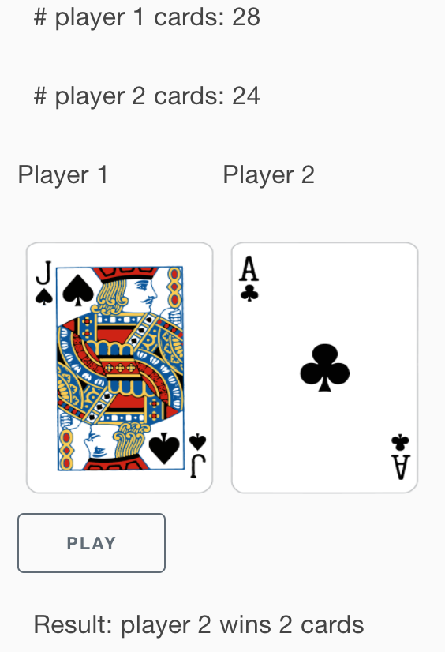
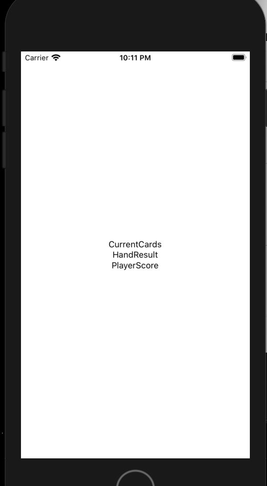
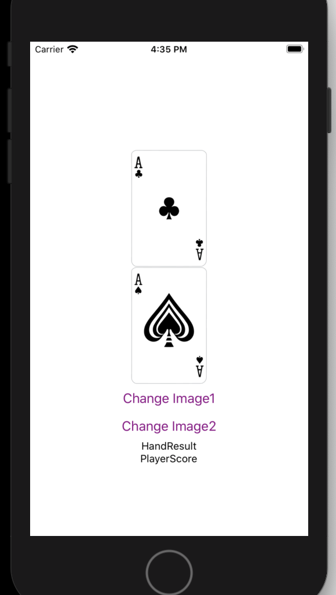

## Refactoring Results...

So as mentioned refactoring helps simplify code for readability and maintainability and possibly other reasons.
I do notice the tests have a lot of repetitious code especially the part where we create the cards.
It would be easier to pass a string like: `'ac kc'` and that would generate an array of two cards. So I created
the following functions to help with that.

```
function getRank(r) {
  switch (r) {
    case 'a':
      return Rank.Ace;
    case 'k':
      return Rank.King;
    case 'q':
      return Rank.Queen;
    case 'j':
      return Rank.Jack;
    case 't':
      return Rank.Ten;
    case '9':
      return Rank.Nine;
    case '8':
      return Rank.Eight;
    case '7':
      return Rank.Seven;
    case '6':
      return Rank.Six;
    case '5':
      return Rank.Five;
    case '4':
      return Rank.Four;
    case '3':
      return Rank.Three;
    case '2':
      return Rank.Two;
  }
}

function getSuit(s) {
  switch (s) {
    case 'c':
      return Suit.Club;
    case 's':
      return Suit.Spade;
    case 'd':
      return Suit.Diamond;
    case 'h':
      return Suit.Heart;
  }
}

function createCards(cardStr) {
  return cardStr.split(' ').map((c) => new Card(getRank(c[0]), getSuit(c[1])));
}
```

Note, there isn't any error checking.
And now the fun part...replace the array construction of cards like this: (first test example)

```
  game.player1.cards = createCards('ac kc');
  game.player2.cards = createCards('ks qs');
```

I don't really have any other ideas about the tests (maybe you do? if so put it in the comments or make a PR).

So looking at `Game` class, I do something annoying:

```
 compareCards(card1, card2) {
    if (card1.getValue() > card2.getValue()) {
      return 1;
    } else if (card1.getValue() < card2.getValue()) {
      return -1;
    }
    return 0;
  }
```

It returns a number, but thats not helpful. What do the numbers
mean? You would have to look at the code. How about if the numbers had names?

```
 compareCards(card1, card2) {
    if (card1.getValue() > card2.getValue()) {
      return CARD1_HIGHER;
    } else if (card1.getValue() < card2.getValue()) {
      return CARD2_HIGHER;
    }
    return CARDS_TIED;
  }
```

and define those outside the class as such:

```
const CARD1_HIGHER = 1;
const CARD2_HIGHER = -1;
const CARDS_TIED = 0;
```

Unfortunately Javascript doesn't let us define constants in the class. Go ahead and change the constants in the code.
Another thing I see is the following code:

```
  this.player1.cards.push(card1);
  this.player1.cards.push(card2);
  this.player1.cards.push(
    ...player1HiddenCards,
    ...player2HiddenCards,
    ...this.player1TiedCards,
    ...this.player2TiedCards
  );
  this.player1TiedCards = [];
  this.player2TiedCards = [];
```

and that is kind of repeated:

```
  this.player2.cards.push(card1);
  this.player2.cards.push(card2);
  this.player2.cards.push(
    ...player1HiddenCards,
    ...player2HiddenCards,
    ...this.player1TiedCards,
    ...this.player2TiedCards
  );
  this.player1TiedCards = [];
  this.player2TiedCards = [];
```

and so if were to refactor these 2 blocks of code, then the function could look like:

```
 addCards(player, card1, card2, player1HiddenCards, player2HiddenCards) {
    player.cards.push(card1);
    player.cards.push(card2);
    player.cards.push(
      ...player1HiddenCards,
      ...player2HiddenCards,
      ...this.player1TiedCards,
      ...this.player2TiedCards
    );
    this.player1TiedCards = [];
    this.player2TiedCards = [];
  }
```

Lets do that:
`this.addCards(this.player1, card1, card2, player1HiddenCards, player2HiddenCards);`
and
`this.addCards(this.player2, card1, card2, player1HiddenCards, player2HiddenCards);`

So I'm seeing another minor code duplication...

```
  player1HiddenCards.push(this.player1.cards.shift());
  player1HiddenCards.push(this.player1.cards.shift());
  player1HiddenCards.push(this.player1.cards.shift());
  player2HiddenCards.push(this.player2.cards.shift());
  player2HiddenCards.push(this.player2.cards.shift());
  player2HiddenCards.push(this.player2.cards.shift());
```

We can combine that to a function:

```
  addHiddenCards(hiddenCards, cards) {
    hiddenCards.push(cards.shift());
    hiddenCards.push(cards.shift());
    hiddenCards.push(cards.shift());
  }
```

update:

```
  this.addHiddenCards(player1HiddenCards, this.player1.cards);
  this.addHiddenCards(player2HiddenCards, this.player2.cards);
```

Another thing...whenever in the code we have numbers, we call them magic numbers, its better
to create a constant that can be read or a readable function. So lets go through the rest of the code and see
what we can replace.
`if (this.player2.cards.length === 0) {`
could be replaced with:
`if (this.isEmpty(this.player2.cards)) {`
and then you can create this function:

```
  isEmpty(cards) {
    return cards.length === 0;
  }
```

That makes it slightly easier to read.

I also see a couple places where the number 4 is.
We should define a constant for those:

```
const MIN_PLAYABLE_LENGTH = 4;
const CARDS_FOR_WAR_LEN = 4;
```

Replace
`if (this.player1.cards.length < MIN_PLAYABLE_LENGTH) {`
`} else if (this.player2.cards.length < MIN_PLAYABLE_LENGTH) {`
and
`player2Cards: this.player2.cards.slice(0, CARDS_FOR_WAR_LEN)`
`player1Cards: this.player1.cards.slice(0, CARDS_FOR_WAR_LEN),`

That may be it for now. As before if you see something more that can be
improved open a PR:)

## Setting up the UI

I think we are good with our war `Game` class, so lets get the UI going a little bit. We will add a couple
cards on the screen and figure out how the UI looks.

For the most basic of UI that we will need is the ability to show 2 cards, a play button, and the ability
to see the score. For the future we will like to add a reset (or start over) button.
Basic UI:
, so that will be somewhat similar to what we will try to implement.
In our project, lets create a directory called `components`. This is typical and this is where will be place all our different pieces of the UI. Looking at the image above, we could have the following components:

- Card
- CurrentCards (this will have both Cards and labels to say which card is for which player)
- HandResult (the current result of the hand)
- PlayerScore (player name and card count)

Inside components go ahead an create `Card.js`

```
import React from 'react';
import {Text} from 'react-native';

const Card = () => {
  return <Text>Card</Text>;
};

export default Card;
```

Do similar for `CurrentCards`, `HandResult`, and `PlayerScore`. We will use `App.js` to compose all of these components.

Lets add these to App.js and write a test.

```
export default function App() {
  return (
    <View style={styles.container}>
      <CurrentCards />
      <HandResult />
      <PlayerScore />
      <StatusBar style="auto" />
    </View>
  );
}
```

and add these imports:

```
import CurrentCards from './components/CurrentCards';
import HandResult from './components/HandResult';
import PlayerScore from './components/PlayerScore';
```

Btw, there is a test for `App.js` and it should pass.

And now we can try running it. So we can do 4 things. If you look at package.json you see we can run

```
    "start": "expo start",
    "android": "expo start --android",
    "ios": "expo start --ios",
    "web": "expo start --web",
```

Try running `yarn start`. This will open a web page and you can select what to run in. I would run in an emulator because we building an app and its good to start testing on the emulator right away (but its better to test on an actual device as well), but for speed and simplicity choose Android or iOS depending on what platform and what you have installed. I'm going to run iOS.
You should see something similar to this:


So interestingly something to consider in terms of code re-use. Should be all of these components in the App class? Maybe or should create a another component called `WarGame` and put it in the components folder and have that contain all the UI components and state and just export that. We could then take our WarGame class and embed that into any React Native application.
Lets do that.
`WarGame.js`:

```
import React from 'react';
import {StyleSheet, View} from 'react-native';
import CurrentCards from './CurrentCards';
import HandResult from './HandResult';
import PlayerScore from './PlayerScore';

export default function WarGame() {
  return (
    <View style={styles.container}>
      <CurrentCards />
      <HandResult />
      <PlayerScore />
    </View>
  );
}

const styles = StyleSheet.create({
  container: {
    flex: 1,
    backgroundColor: '#fff',
    alignItems: 'center',
    justifyContent: 'center',
  },
});
```

And modify `App.js` to just include `WarGame`.
Lets not forget to write a test. Create a folder called `components` inside of `__tests__` and create `WarGame.js`.
Put this inside `WarGame.js`...which is very similar to the test for `App.js`:

```
import 'react-native';
import React from 'react';
import WarGame from '../../components/WarGame';

// Note: test renderer must be required after react-native.
import renderer from 'react-test-renderer';

it('renders correctly', () => {
  renderer.create(<WarGame />);
});
```

Lets not forget about our images. In our assets directory copy your images there. If you used the images I provided I copied the `PNG` directory to the assets directory.

We'll finish up this part by showing a couple cards.
Open `Card.js` and add the following code:

```
import React from 'react';
import {View, Image, StyleSheet, Button} from 'react-native';
import cardMap from './Cards';

const styles = StyleSheet.create({
  container: {
    paddingTop: 50,
  },
  logo: {
    width: 166,
    height: 158,
    resizeMode: 'contain',
  },
});

const Card = () => {
  const [imageOne, setImageOne] = React.useState(cardMap.get('ac'));
  const [imageTwo, setImageTwo] = React.useState(cardMap.get('as'));
  return (
    <View style={styles.container}>
      <Image source={imageOne} style={styles.logo} />
      <Image source={imageTwo} style={styles.logo} />
      <Button
        title="Change Image1"
        color="#841584"
        onPress={() => setImageOne(cardMap.get('qs'))}
      />
      <Button
        title="Change Image2"
        color="#841584"
        onPress={() => setImageTwo(cardMap.get('6d'))}
      />
    </View>
  );
};

export default Card;
```

So with React Native its really hard to change the card dynamically with local cards. If we put these card images on a server and then it is supported to change the card by changing the uri field of the source.

We are keeping the cards local to the app because it is more performant and we don't have to rely on a internet connection. So, we end up creating a new module called `Cards.js` which load all the card image files.
`Cards.js`

```
import CA from '../assets/PNG/AC.png';
import CK from '../assets/PNG/KC.png';
import CQ from '../assets/PNG/QC.png';
import CJ from '../assets/PNG/JC.png';
import CT from '../assets/PNG/TC.png';
import C9 from '../assets/PNG/9C.png';
import C8 from '../assets/PNG/8C.png';
import C7 from '../assets/PNG/7C.png';
import C6 from '../assets/PNG/6C.png';
import C5 from '../assets/PNG/5C.png';
import C4 from '../assets/PNG/4C.png';
import C3 from '../assets/PNG/3C.png';
import C2 from '../assets/PNG/2C.png';

import HA from '../assets/PNG/AH.png';
import HK from '../assets/PNG/KH.png';
import HQ from '../assets/PNG/QH.png';
import HJ from '../assets/PNG/JH.png';
import HT from '../assets/PNG/TH.png';
import H9 from '../assets/PNG/9H.png';
import H8 from '../assets/PNG/8H.png';
import H7 from '../assets/PNG/7H.png';
import H6 from '../assets/PNG/6H.png';
import H5 from '../assets/PNG/5H.png';
import H4 from '../assets/PNG/4H.png';
import H3 from '../assets/PNG/3H.png';
import H2 from '../assets/PNG/2H.png';

import SA from '../assets/PNG/AS.png';
import SK from '../assets/PNG/KS.png';
import SQ from '../assets/PNG/QS.png';
import SJ from '../assets/PNG/JS.png';
import ST from '../assets/PNG/TS.png';
import S9 from '../assets/PNG/9S.png';
import S8 from '../assets/PNG/8S.png';
import S7 from '../assets/PNG/7S.png';
import S6 from '../assets/PNG/6S.png';
import S5 from '../assets/PNG/5S.png';
import S4 from '../assets/PNG/4S.png';
import S3 from '../assets/PNG/3S.png';
import S2 from '../assets/PNG/2S.png';

import DA from '../assets/PNG/AD.png';
import DK from '../assets/PNG/KD.png';
import DQ from '../assets/PNG/QD.png';
import DJ from '../assets/PNG/JD.png';
import DT from '../assets/PNG/TD.png';
import D9 from '../assets/PNG/9D.png';
import D8 from '../assets/PNG/8D.png';
import D7 from '../assets/PNG/7D.png';
import D6 from '../assets/PNG/6D.png';
import D5 from '../assets/PNG/5D.png';
import D4 from '../assets/PNG/4D.png';
import D3 from '../assets/PNG/3D.png';
import D2 from '../assets/PNG/2D.png';

const cardMap = new Map();

cardMap.set('ac', CA);
cardMap.set('kc', CK);
cardMap.set('qc', CQ);
cardMap.set('jc', CJ);
cardMap.set('tc', CT);
cardMap.set('9c', C9);
cardMap.set('8c', C8);
cardMap.set('7c', C7);
cardMap.set('6c', C6);
cardMap.set('5c', C5);
cardMap.set('4c', C4);
cardMap.set('3c', C3);
cardMap.set('2c', C2);

cardMap.set('ah', HA);
cardMap.set('kh', HK);
cardMap.set('qh', HQ);
cardMap.set('jh', HJ);
cardMap.set('th', HT);
cardMap.set('9h', H9);
cardMap.set('8h', H8);
cardMap.set('7h', H7);
cardMap.set('6h', H6);
cardMap.set('5h', H5);
cardMap.set('4h', H4);
cardMap.set('3h', H3);
cardMap.set('2h', H2);

cardMap.set('as', SA);
cardMap.set('ks', SK);
cardMap.set('qs', SQ);
cardMap.set('js', SJ);
cardMap.set('ts', ST);
cardMap.set('9s', S9);
cardMap.set('8s', S8);
cardMap.set('7s', S7);
cardMap.set('6s', S6);
cardMap.set('5s', S5);
cardMap.set('4s', S4);
cardMap.set('3s', S3);
cardMap.set('2s', S2);

cardMap.set('ad', DA);
cardMap.set('kd', DK);
cardMap.set('qd', DQ);
cardMap.set('jd', DJ);
cardMap.set('td', DT);
cardMap.set('9d', D9);
cardMap.set('8d', D8);
cardMap.set('7d', D7);
cardMap.set('6d', D6);
cardMap.set('5d', D5);
cardMap.set('4d', D4);
cardMap.set('3d', D3);
cardMap.set('2d', D2);

export default cardMap;
```

This module also creates a map which we conveniently will map a string (the `Card` class's `toShortString` method) to the image.

Go ahead and run this and click on the buttons. The cards should change.


### Exercises

- Our war `Game` class is pure Javascript. How can we set it up in such a way that this class can be
  used by any Javascript application? Through npm packages. So do some research. There are a lot of
  articles about how to accomplish this.
- The button in the code above will change the card once. What would you do if you wanted to show a
  random card? Or if you used the `Deck` class?

### Next Part

- We will implement more of the UI and write tests.
- Talking about state management.
- Starting the game of war.

You see the code for this part in the repo by running the following command: `git checkout part3`
