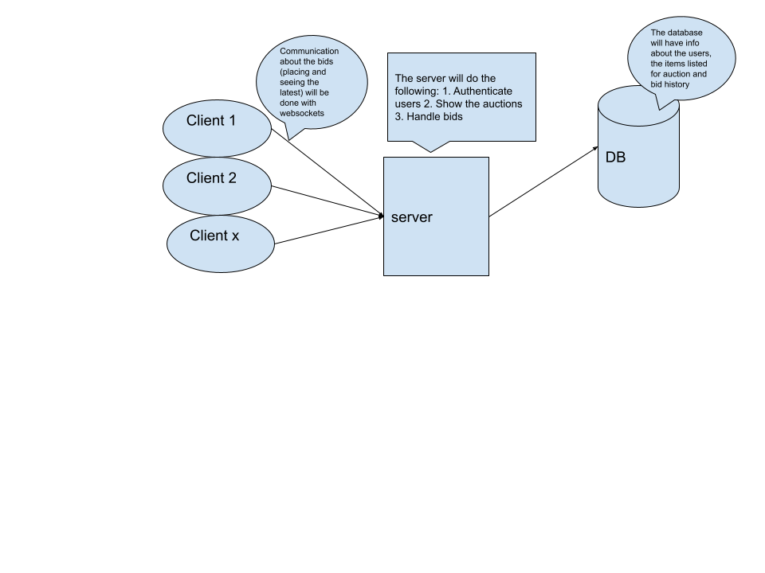
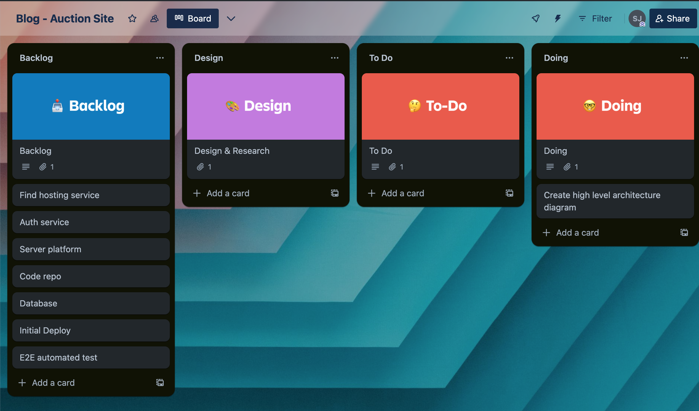

## Tasks

After defining the problem to solve, we need to create some high level overview of the components and tasks. Creating some git repos, finding a hosting service, DB service and connecting these components
would be a good first step...so I'm thinking the following:

- mongoDB atlas
- clerk for auth
- nextjs for the server
- render.com to host (haven't tried this one, but looks good)
- github for code

Here is a simple view of the components in action:

Here is a starter list of the tasks needed:

Next up: DB schema and some wire-frame views of the front end.
