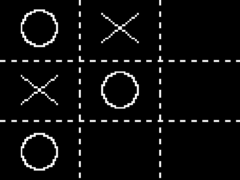

## Why
First off, tic-tac-toe is pretty simple and probably over done, but I think this
tutorial series is not going to focus on the problem (the actual game), but on to 
construct the overall architecture of building a React app.

## What
This is what we will focus on the following:
  - building a simple version which has many problems
  - improve the simple version
  - make it a general game (NxN board)
  - introduce some functional programming concepts
  - better UI (HTML canvas)
  - how about some AI?
  - how about even more AI?
  - play against another player
  - even better UI (3D graphics)

## Simple Version
1. We'll use [Vite](https://vitejs.dev/guide/), so lets create the app by doing: `npm create vite@latest`
and answer the following prompts with React and Typescript.

2. cd into the directory and `npm run dev`

3. We will quickly build the code and then we'll update this so it
extensible and testable.

Create a directory: `components` and create file in there `TicTacToe.tsx and TicTacToe.css`
Add the following to `TicTacToe.tsx`:
```
const TicTacToe = () => {
  return <div>tictactoe</div>;
};

export default TicTacToe;
```
Open `App.tsx` and delete the content and the component.

Lets use CSS grid for the layout...add the following to the TicTacToe.css file:
```
grid {
  display: grid;
  grid-template-columns: 100px 100px 100px;
  grid-template-rows: 100px 100px 100px;
}

.grid > div {
  border: 1px solid gray;
  display: flex;
  justify-content: center;
  align-items: center;
}
```
Lets also think about state.
* Track which players turn it is
* What value each square in the has (empty, X, O)

Lets use an array for the state and a variable for the turn.
```
const [gameStates, setGameStates] = React.useState<GameState[]>(() =>
    Array(9).fill(GameState.Empty)
  );
```
add this type:
```
enum GameState {
  Empty = '',
  X = 'X',
  O = 'O',
}
```

`TicTacToe` should return this:
```
  return (
    <div className="grid">
      {gameStates.map((state, i) => (
        <div key={i}>{state}</div>
      ))}
    </div>
  );
  ```

  We need to handle a click.  Our callback will get the index and we'll
  set the player in the array. Player 1 will be X and player 2 will be Y.

  change the `div` line to this: `<div key={i} onClick={() => handleClick(i)}>`

  add the `handleClick` function:
  ```
   const handleClick = React.useCallback(
    (i: number) => {
      const newGameState = [...gameStates];
      newGameState[i] = playerTurn === PlayerTurn.One ? GameState.X : GameState.O;
      setGameStates(newGameState);
      setPlayerTurn(playerTurn === PlayerTurn.One ? PlayerTurn.Two : PlayerTurn.One);
    },
    [gameStates, playerTurn]
  );
  ```

  We need the `PlayerTurn`:
  ```
  enum PlayerTurn {
    One,
    Two,
  }
```
and its state:
`const [playerTurn, setPlayerTurn] = React.useState(PlayerTurn.One);`

Right now, you can click the square and it will overwrite the previous value
and there is no logic...lets add that.

<details>
<summary>Answer</summary>
<pre>
<code>
  if (gameStates[i] !== GameState.Empty) {
        return;
  }
</code>
</pre>
</details>

Add a message to the top of the component describing whose turn it is (also this
will be the place where will be show the winner or tie).

<details>
<summary>Answer</summary>
<pre>
<code>
<p className="message">{showGameMessage(playerTurn)}</p>
</code>
</pre>
</details>

<pre>
<code>
const showGameMessage = (turn: PlayerTurn) => {
  return turn === PlayerTurn.One ? 'Player 1 turn' : 'Player 2 turn';
};
</pre>
</code>

<pre>
<code>
.message {
  margin: 10px;
}
</pre>
</code>
</details>

And now for the fun part...lets detect when the game is won or tied:

Note: there are multiple ways to solve this...

```
const showGameMessage = (state: GameState[], turn: PlayerTurn) => {
  const status = getGameStatus(state, turn);
  if (status) return status;
  return turn === PlayerTurn.One ? 'Player 1 turn' : 'Player 2 turn';
};

const getGameStatus = (state: GameState[], turn: PlayerTurn) => {
  if (checkTie(state)) {
    return 'Game Tied';
  }
  if (checkRows(state)) {
    return turn === PlayerTurn.One ? 'Player 2 Wins!' : 'Player 1 Wins!';
  }
  if (checkColumns(state)) {
    return turn === PlayerTurn.One ? 'Player 2 Wins!' : 'Player 1 Wins!';
  }
  if (checkDiagonals(state)) {
    return turn === PlayerTurn.One ? 'Player 2 Wins!' : 'Player 1 Wins!';
  }
  return '';
};

const checkTie = (state: GameState[]) => {
  return !state.some((x) => x === GameState.Empty);
};

const checkRows = (state: GameState[]) => {
  if (state[0] !== GameState.Empty && state[0] === state[1] && state[1] === state[2]) return true;
  if (state[3] !== GameState.Empty && state[3] === state[4] && state[4] === state[5]) return true;
  if (state[5] !== GameState.Empty && state[6] === state[7] && state[7] === state[8]) return true;
  return false;
};

const checkColumns = (state: GameState[]) => {
  if (state[0] !== GameState.Empty && state[0] === state[3] && state[3] === state[6]) return true;
  if (state[1] !== GameState.Empty && state[1] === state[4] && state[4] === state[7]) return true;
  if (state[2] !== GameState.Empty && state[2] === state[5] && state[5] === state[8]) return true;
  return false;
};

const checkDiagonals = (state: GameState[]) => {
  if (state[0] !== GameState.Empty && state[0] === state[4] && state[4] === state[8]) return true;
  if (state[2] !== GameState.Empty && state[2] === state[4] && state[4] === state[6]) return true;
  return false;
};
```

btw, there is one bug...find it and fix it!

Questions to think about:
1. How do we test this?
2. How do we separate out the logic and UI?
3. How to check for a general case for a NxN grid?
4. More efficient way to check for a tie?

Some features to add:
1. Add a `New Game` button
2. Keep track of wins/losses/ties
3. Improve the UI experience