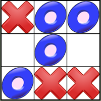

## What's wrong

1. The logic is tied up with the UI
2. There isn't any testing
3. UI is really boring


## Component State & useReducer
Lets think about the what we are keeping track of in the component. Its the following:
* the gameState which is actually the grid (or board)
* which players turn
And what actions are we taking against this state:
* a click in a square
* reset the game

With that in mind, we are going to moving this state into another module and using the `useReducer` [hook](https://react.dev/reference/react/useReducer).  This is pattern were we will encapsulate our state into a function and have that function handle all of the actions.
Create a file called `state.ts` in the component directory.  
Think about a type which will keep track of all the state:
details>
<summary>Answer</summary>
<pre>
<code>
 type State = {
  board: Array<GameState>;
  playerTurn: PlayerTurn;
};
</code>
</pre>
</details>
Fix the errors by copying the `GameState` and `PlayerTurn` enums.

And if you read the documentation we need to add the hook to our class and
provide a `reducer` function and some initial data.

Add the hook to the component:`const [state, dispatch] = React.useReducer(reducer, initialData);`

We need some initial data for the hook...how does that look:
<summary>Answer</summary>
<pre>
<code>
 const initialData: State = {
  board: Array(9).fill(GameState.Empty),
  playerTurn: PlayerTurn.One,
};
</code>
</pre>
</details>

Add the reducer function to state.ts: `const reducer = (state: State, action: any) => {};` and import that function and `State`.


An aside:
*You may be wondering of the name `reducer`, well it is slightly confusing.
A reducer is a function that reduces a set of values to a single value (see the [`reduce`](https://developer.mozilla.org/en-US/docs/Web/JavaScript/Reference/Global_Objects/Array/Reduce) method of Array), but our `reducer` takes a state and action and returns state.  You can call the reducer function anything you want, but we'll keep the terminology.*

We will now define the actions:
```
enum TicTacToeActionType {
  CLICK = 'CLICK',
  RESET = 'RESET',
}
```
The reducer will handle these 2 actions.
The reducer will also take some data, the payload:
```
type TicTacToeAction = {
  type: TicTacToeActionType;
  payload: any;
};
```
Lets define what the different payloads will be.
When a user clicks in a square we want to know what the index is.
```
type ClickPayload = {
  index: number
}
```
and for reset, the payload will be empty, so we won't define it.

so then we can get rid of the `any`:
```
type TicTacToeAction = {
  type: TicTacToeActionType;
  payload: ClickPayload;
};
```
Also change the reducer's signature:
`export const reducer = (state: State, action: TicTacToeAction) => {};`

Let define what the reducer will do.  It will return a new state (and not modify th e old one).
```
export const reducer = (state: State, action: TicTacToeAction) => {
  switch (action.type) {
    case TicTacToeActionType.CLICK: {
      const newBoard = [...state.board];
      newBoard[action.payload.index] =
        state.playerTurn === PlayerTurn.One ? GameState.X : GameState.O;
      return {
        ...state,
        board: newBoard,
        playerTurn: state.playerTurn === PlayerTurn.One ? PlayerTurn.Two : PlayerTurn.One,
      };
    }
    default:
      break;
  }
  return state;
};
```

Now define what the reset case is:
<summary>Answer</summary>
<pre>
<code>
    case TicTacToeActionType.RESET: {
      return initialData;
    }

    // Add copy the initialData to the state.ts file
</code>
</pre>
</details>


Then add checks in the click case:
<summary>Answer</summary>
<pre>
<code>
      if (state.board[action.payload.index] !== GameState.Empty) {
        return;
      }
</code>
</pre>
</details>

And you may be asking...how does this click event happen. This is where the `dispath` function comes in.
We need to call dispatch this way:
`onClick={() => dispatch({type: TicTacToeActionType.CLICK, payload: {index: i}})}`

Make that change.
And now add the reset button:

<summary>Answer</summary>
<pre>
<code>
      <div>
        <button onClick={() => dispatch({type: TicTacToeActionType.RESET})}>Reset</button>
      </div>
</code>
</pre>
</details>

We can make our UI file a little bit more cleaner.  Lets move all the helper functions to figure
out the game message.  
This is how our tsx file looks like now:
```
import React from 'react';
import './TicTacToe.css';
import {reducer, TicTacToeActionType, GameState,initialData, showGameMessage} from './state';

const TicTacToe = () => {
  const [state, dispatch] = React.useReducer(reducer, initialData);

  return (
    <>
      <div>{showGameMessage(state.board, state.playerTurn)}</div>
      <div className="grid">
        {state.board.map((state: GameState, i: number) => (
          <div
            key={i}
            onClick={() => dispatch({type: TicTacToeActionType.CLICK, payload: {index: i}})}
          >
            {state}
          </div>
        ))}
      </div>
      <div>
        <button onClick={() => dispatch({type: TicTacToeActionType.RESET})}>Reset</button>
      </div>
    </>
  );
};

export default TicTacToe;
```

So as noted in the previous post, there is a bug.  The bug is if the game is won, then
you can still keep clicking on empty squares.  So we have to do something different to fix
this bug.  We need to figure out in the reducer after a square is clicked who
the winner is or not (and set the message).  We could keep another state variable that says if the
game is finished.  
Lets add the following 2 fields to the state:
```
 message: string;
 finished: boolean;
```
If finished is set, then we return directly from the click handler.

Lets do the following in the `reducer` function:
```
export const reducer = (state: State, action: TicTacToeAction) => {
  switch (action.type) {
    case TicTacToeActionType.CLICK: {
      if (state.finished) {
        return state;
      }
      if (state.board[action.payload.index] !== GameState.Empty) {
        return state;
      }
      const newBoard = [...state.board];
      newBoard[action.payload.index] =
        state.playerTurn === PlayerTurn.One ? GameState.X : GameState.O;
      const nextPlayerTurn = state.playerTurn === PlayerTurn.One ? PlayerTurn.Two : PlayerTurn.One;
      const message = getGameMessage(newBoard, nextPlayerTurn);
      return {
        ...state,
        board: newBoard,
        playerTurn: nextPlayerTurn,
        message,
        finished: message.search('Win') > 0,
      };
    }
    case TicTacToeActionType.RESET: {
      return initialData;
    }
    default:
      break;
  }
  return state;
};
```
We return the game message now and set the game finished if the message contains the word "Win".  (Probably not the best way, but it will work.)

So we can run this a few times, but how do we know if this code actually works.  This is where
testing will come in.  This is a fairly simple component that doesn't interact with anything else
so a set of unit tests should be sufficient. If this component was interacting with other components,
then a more complex unit test with mock data would be needed or an integration test.

## Testing & UI Improvements
Next blog post!