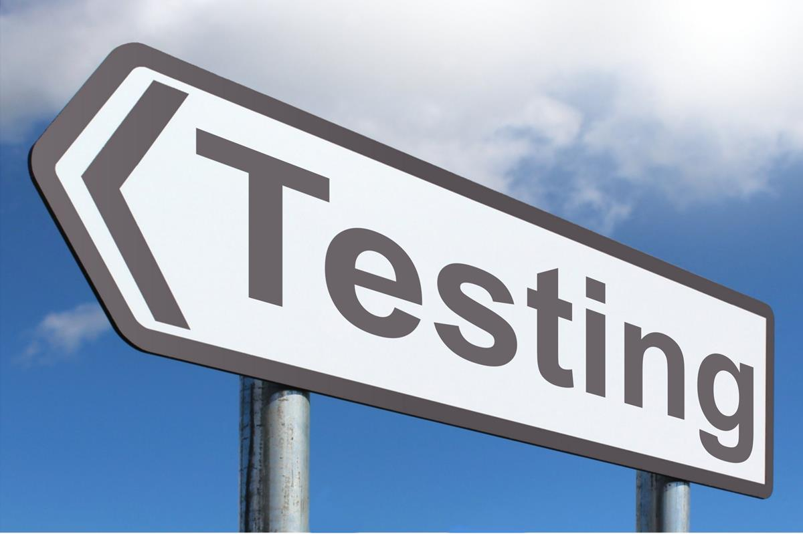

## Why
<quote>"Testing can only prove the presence of bugs, not their absence" - Edsger Dijkstra</quote>

So from that quote it would seem testing might not be that useful.  It is useful in many respects.
Its important to have at an baseline of code that is free from bugs.  Having sufficient code
coverage allow us to refactor code confidently.  We can use methods like [Test Driven Development](https://en.wikipedia.org/wiki/Test-driven_development) (TDD for short), to help us develop code
in a more bug-free manner.

## Methods
There are various levels of testing.
1. Unit testing: allows us to test code at a modular or class level, while mocking dependencies.
2. Integration testing: allows us to test multiple modules together and mock dependencies.
3. e2e (end-to-end) testing: allows us to test the complete program and not mock dependencies.
Usually unit tests are fast and are run automatically after a code change.  Integration and e2e testing can be slow and at times flaky.  We won't do any e2e testing.

## Coverage
Coverage is an interesting concept.  This applies only to unit testing.  The testing tools can figure out how many lines of code are covered by the tests.  Getting to an 100% coverage would seem ideal, but sometimes that can be unattainable due to various factors.  Usually the amount of effort to get to 100% can be 2x or 3x the effort to get the code done.  That doesn't work too well in the engineering process where we need to ship a product.  Usually organizations are happy with anywhere from 60-85%.  With our simple codebase we will try to get to about 90%.

## Vitest
Lets install vitest: `npm install -D vitest` more info [here](https://vitest.dev/guide/).
Add this to your scripts section in `package.json`:
`"test": "vitest"`

## Writing reducer tests
Add a file: `state.test.ts`.  We will add a test suite (follow the example from [here](https://github.com/vitest-dev/vitest/blob/main/examples/basic/test/suite.test.ts)).
Here is a first test for the RESET action:
```
import {describe, expect, it} from 'vitest';
import {reducer, TicTacToeActionType, GameState, initialData} from './state';

describe('Reducer tests', () => {
  it('handle RESET action', () => {
    const state = {
      ...initialData,
      finished: true,
      board: [
        GameState.X,
        GameState.O,
        GameState.X,
        GameState.O,
        GameState.X,
        GameState.O,
        GameState.X,
        GameState.O,
        GameState.X,
      ],
    };
    const action = {type: TicTacToeActionType.RESET, payload: {index: 0}};
    const newState = reducer(state, action);
    expect(newState).toEqual(initialData);
  });
});
```
Run `npm run test`.  This test should pass and vite will run the test again when the file changes.

Try a test or tests for the click action:
<summary>Answer</summary>
<pre>
<code>
  it('handle CLICK action', () => {
    const state = initialData;
    const action = {type: TicTacToeActionType.CLICK, payload: {index: 0}};
    const newState = reducer(state, action);
    expect(newState.board[0]).toEqual(GameState.X);
  });

  it('handle CLICK action on non-empty cell', () => {
    const state = {
      ...initialData,
      board: [
        GameState.X,
        GameState.Empty,
        GameState.Empty,
        GameState.Empty,
        GameState.Empty,
        GameState.Empty,
        GameState.Empty,
        GameState.Empty,
        GameState.Empty,
      ],
    };
    const action = {type: TicTacToeActionType.CLICK, payload: {index: 0}};
    const newState = reducer(state, action);
    expect(newState).toEqual(state);
  });

  it('handle CLICK action on finished game', () => {
    const state = {
      ...initialData,
      finished: true,
      board: [
        GameState.X,
        GameState.O,
        GameState.X,
        GameState.O,
        GameState.X,
        GameState.O,
        GameState.X,
        GameState.O,
        GameState.X,
      ],
    };
    const action = {type: TicTacToeActionType.CLICK, payload: {index: 0}};
    const newState = reducer(state, action);
    expect(newState).toEqual(state);
  });
</code>
</pre>
</details>

Notice we aren't testing the actual game flow, but we are testing edge cases which should be good enough and we will check test coverage later.

## Writing UI tests
For UI testing, we are going to use [react testing library](https://testing-library.com/docs/react-testing-library/intro/) (RTL). I'm not going to repeat this info, but If you follow this blog [post](https://www.robinwieruch.de/vitest-react-testing-library/) from `ROBIN WIERUCH`, then we should be able to write UI tests.
Basically we need to create a virtual DOM environment that takes the place of the browser.  Vitest is our test runner and RTL helps out in testing the UI by providing interfaces to access DOM elements and interact with them.

So lets create a `TicTacToe.test.tsx` file and add the following:
```
import {render, screen} from '@testing-library/react';

import TicTacToe from './TicTacToe';

describe('TicTacToe', () => {
  it('renders component', () => {
    render(<TicTacToe />);

    screen.debug();
  });
});
```
Running `npm test` should output the component.

So what should our UI tests actually test?  Should it play an entire game?
Or should we click in a location and just check if player 1 can put an `X`
and player 2 puts a `O`.  I think we should just check basic functionality since we did test the `reducer` for logic.
Write the following tests:
1. Check the component renders (check for the title and reset button).
2. Click inside the grid and check for the `X`.
3. Click another location in the grid and check for the `O`.
Check https://testing-library.com/docs/react-testing-library/example-intro for some help.

<summary>Answer</summary>
<pre>
<code>
  it('renders component', () => {
    render(<TicTacToe />);
    expect(screen.getByText('Player 1 turn')).toBeInTheDocument();
    expect(screen.getByText('Reset')).toBeInTheDocument();
  });

  it('player 1 clicks on cell', async () => {
    render(<TicTacToe />);
    const cell = screen.getByTestId('cell-0');
    act(() => {
      cell.click();
    });
    await waitFor(() => {
      expect(cell).toHaveTextContent('X');
    });
  });

  it('player 2 clicks on cell', async () => {
    render(<TicTacToe />);
    const cell = screen.getByTestId('cell-0');
    act(() => {
      cell.click();
    });
    const cell1 = screen.getByTestId('cell-1');
    act(() => {
      cell1.click();
    });
    await waitFor(() => {
      expect(cell1).toHaveTextContent('O');
    });
  });

  it('player 1 wins', async () => {
    render(<TicTacToe />);
    const cell = screen.getByTestId('cell-0');
    act(() => {
      cell.click();
    });
    const cell1 = screen.getByTestId('cell-1');
    act(() => {
      cell1.click();
    });
    const cell2 = screen.getByTestId('cell-3');
    act(() => {
      cell2.click();
    });
    const cell3 = screen.getByTestId('cell-4');
    act(() => {
      cell3.click();
    });
    const cell4 = screen.getByTestId('cell-6');
    act(() => {
      cell4.click();
    });
    await waitFor(() => {
      expect(screen.getByText('Player 1 Wins!')).toBeInTheDocument();
    });
  });

  it('player 2 wins', async () => {
    render(<TicTacToe />);
    const cell = screen.getByTestId('cell-0');
    act(() => {
      cell.click();
    });
    const cell1 = screen.getByTestId('cell-1');
    act(() => {
      cell1.click();
    });
    const cell2 = screen.getByTestId('cell-3');
    act(() => {
      cell2.click();
    });
    const cell3 = screen.getByTestId('cell-4');
    act(() => {
      cell3.click();
    });
    const cell4 = screen.getByTestId('cell-2');
    act(() => {
      cell4.click();
    });
    const cell5 = screen.getByTestId('cell-7');
    act(() => {
      cell5.click();
    });
    await waitFor(() => {
      expect(screen.getByText('Player 2 Wins!')).toBeInTheDocument();
    });
  });
</code>
</pre>

## Next
Lets test from the outside...more like how an user would use the game.

<quote>
”If debugging is the process of removing software bugs, then programming must be the process of putting them in" - Edsger Dijkstra</quote>